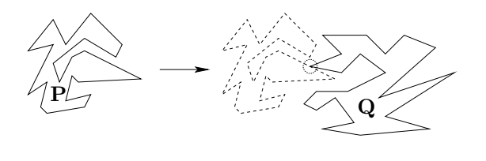
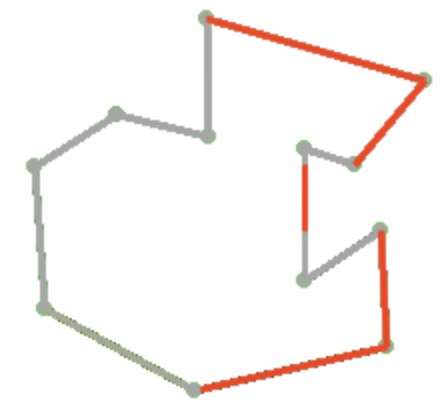
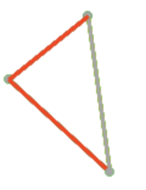

# Collision Detection

## Problem
Given two simple and disjoint polygons P and Q, where P lies strictly to the left of Q, compute the first points on the polygons that will collide if P is translated horizontally and in the positive x-direction, 
or determines that they do not collide.

Time complexity: **`O((n + m) * (log n + log m))`**, where n = |P| and m = |Q|.

## Solution
  * Find visible intervals of both polygons.
  * For each point on left polygon, find where it would hit right polygon.
  * Calculate distance between those two points.
  * Do the same thing for right polygon.
  * Keep track of minimum distance between those points => it's solution ;)
  
### Find visible intervals of polygon
Visible intervals are polygon's lines (or parts of the lines) on which collision could happen.

We will use sweep line algorithm for finding them. Status structure will be `AVL tree`, so this will take **`O(n*(log n))`** time.
 - Sort points by `Y coordinate`.
 - In `sweep line status` keep track of all polygon lines that sweep line intersects.
 - Keep an array of visible intevals. Each interval have:
   * startY 
   * endY (endY > startY)
   * polygonLine - reference to polygon line that contains that interval (parent - we will need it later)
 - Events are polygon points.  
 - For each point **p**, get the rightmost (leftmost) line **l** from sweep line status. Push into visible intervals array new inteval which start on **previously_checked_point.y** and ends on **p.y**, it's parent is **l** .
 - Add all lines that starts from that point into status structure, and delete all lines that ends in that point.
 

 
 ### Finding hit spot on polygon
Once we have all polygon's `visible intervals`, it's easy to find where collision could happen. 
For each point `p` on left (right) polygon, do **binary search** on visible intervals on right (left) polygon to find which interval contains p. That interval's parent is polygon line on which collision will happen - let's call it  `l`.
 > Notice that array with visible intervals is already sorted because we were sweeping throughout sorted points. 

Now, we now **Y coordinate** of collision - it's `p.Y`, also we know line on which collision would happen - it's `l`. We only need to find **X coordinate**. Do some math and it's here: 

> x = (y - n) / k

Doing this for `n` points on left polygon and `m` points for right polygon we get **`O((n + m) * (log n + log m)).`**
 
## Usage

Draw polygon by adding points on canvas (left mouse button).

> First polygon you draw will be left, keep that in mind.

For closing polygon simply press mouse button on first polyogn point.
After drawing left and right polygon, press anywhere to begin algorithm.

